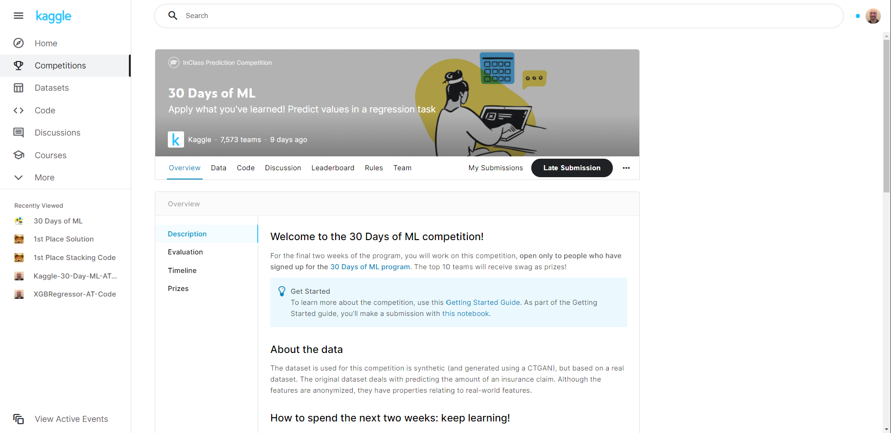

# 30-Days-of_Machine-Learning
This repo is for the 30 Days of Machine Learning competition on Kaggle. We analyze a synthetic (generated using a CTGAN) dataset  in order to design a machine learning model that can minimize the root mean square error (RMSE) of our predicted values. :technologist:


## **Getting Started**
#
**These instructions will get you a copy of the project up and running on your local machine for developement and testing purposes. See [Deployment](#Deployment "Goto **Deployment**") for notes on how to deploy the project on a live system.**

*You can also view the jupyter notebooks: [feature engineering](Kaggle-30-Day-ML-AT-Feature-Engineering.ipynb), [model blending](Kaggle-30-Day-ML-AT-Model-Blending.ipynb), [model stacking](Kaggle-30-Day-ML-AT-Model-Stacking.ipynb), [target encoding](Kaggle-30-Day-ML-AT-Target-Encoding.ipynb), [hyperparameter tuning](Kaggle-30-Day-ML-AT-Hyperparameter-Tuning-Optuna.ipynb), or [feature engineering](Kaggle-30-Day-ML-AT-Feature-Engineering.ipynb) here in the Github repo, or scroll down to see the project visuals.*


## **Prerequisites**
#
**What things you need to install the software and how to install them.**

* GitHub Account

* Python
    * Libraries: pandas, NumPy, scikit-learn, xgboost, and optuna

* Git

* Kaggle account
    * Sign up [here](https://www.kaggle.com/)

## **Installing**
#
**A step by step series of examples that tell you how to get a development environment running.**

*We are using Python and Jupyter Notebook so those two should be installed. I recommend using [Anaconda](https://docs.anaconda.com/anaconda/user-guide/index.html) and [Conda](https://docs.conda.io/projects/conda/en/latest/user-guide/) (both are free) to create a virtual environment if you currently don't have either one installed. Follow the instructions below to set these up on a PC. For additional information on Python Virtual Environments click [here](https://docs.python.org/3/tutorial/venv.html).*

**Python**
* Download and install [Anaconda](https://www.anaconda.com/products/individual)
    * Click download and select the latest Python version.
    * Open the installer and follow the instructions to complete the installation.
* Verify [Conda](https://docs.conda.io/projects/conda/en/latest/user-guide/) is installed by entering the following command into your terminal window:
```
conda --version
```
* Update Conda by running the following command into your terminal window:
```
conda update conda
```

* From your terminal run the following code to install [pip](https://pip.pypa.io/en/stable/):
```
conda install pip
```
* *pip is the package installer for Python. This will come in handy for the Python libraries we will be installing.*
    * *Python is infamous for its [libraries](https://en.wikipedia.org/wiki/Category:Python_(programming_language)_scientific_libraries).*

**Git**
* Download a free version control system called [Git](https://git-scm.com/).
    * *Git is a great way to interact with [GitHub](https://github.com/). You are currently viewing this repository on GitHub so I'm assuming you already have an account. If not, Sign up now.*

    * Go through the installation until you get to the "Choosing the default editor used by Git".
        * Select "Use Visual Studio Code as Git's default editor" if you don't already have a code editor installed. 
            * Download Visual Studio Code [here](https://code.visualstudio.com/).
    * Set up your user name in Git by following the instructions [here](https://docs.github.com/en/get-started/getting-started-with-git/setting-your-username-in-git).
    * Set up your user email address in Git by following the instructions [here](https://docs.github.com/en/github/setting-up-and-managing-your-github-user-account/managing-email-preferences/setting-your-commit-email-address).
    * Set up your SSH keys in Git by following the steps in this [video](https://www.youtube.com/watch?v=Nf2Ggt3Mwgk).

**Python Libraries**

*Click the library name for instructions on how to download.*
* [pandas](https://pandas.pydata.org/docs/getting_started/install.html)
* [NumPy](https://numpy.org/install/)  
* [scikit-learn](https://scikit-learn.org/stable/install.html)
* [xgboost](https://pypi.org/project/xgboost/)
* [optuna](https://pypi.org/project/optuna/)

**Clone the repo**
1. In GitHub, in this repository (repo), Fork a copy of this repo by selecting "Fork".
    * For additional information click [here](https://docs.github.com/en/desktop/contributing-and-collaborating-using-github-desktop/adding-and-cloning-repositories/cloning-and-forking-repositories-from-github-desktop).
    
    * You should now have a Fork of this repo in your "Your repositories" on your GitHub account. 
2. In GitHub under "Your repositories, select the name of this repo.
    * Find the "Code" dropdown.
        * Select "SSH" and copy the entire line of code.
        *It should look similar to: "git@github.com:YourUserName/RepoName.git"*

3. Open A Git Bash terminal window where you would like to clone this repo.
    * *For now, you can open the terminal window on your desktop if you don't have another location in mind.*

4. Type the following code into your Git Bash terminal:
```
git clone
```

5. Paste the SSH key copied from step 2 after "git clone ", then press Enter.
    * *You should now have a clone of this repo on your local machine.* 


## **Deployment**
#

**Open Jupyter Notebook**

1. Open a Git Bash terminal from your repo file.

2. In your Git Bash terminal, type the following code: 
```
source activate PythonData
```
* *(PythonData) should now be displayed in your Git Bash terminal.*


3. In your Git Bash terminal, type the following code: 
```
jupyter notebook
```
* *You should now see a Jupyter Notebook tab open in your web browser.*

# **Acknowledgments**
#
* I'd like to thank [Dominic LaBella](https://www.linkedin.com/in/dominiclabella/), my instructor at the Data Visualization and Analytics Boot Camp I attended, for planting a seed in my brain that was the start of my computer programming knowledge and understanding. I work hard every day to grow that seed. None of this would be possible for me if not for his passion for teaching and deep understanding of these subjects.

## **Project Visuals**
#



